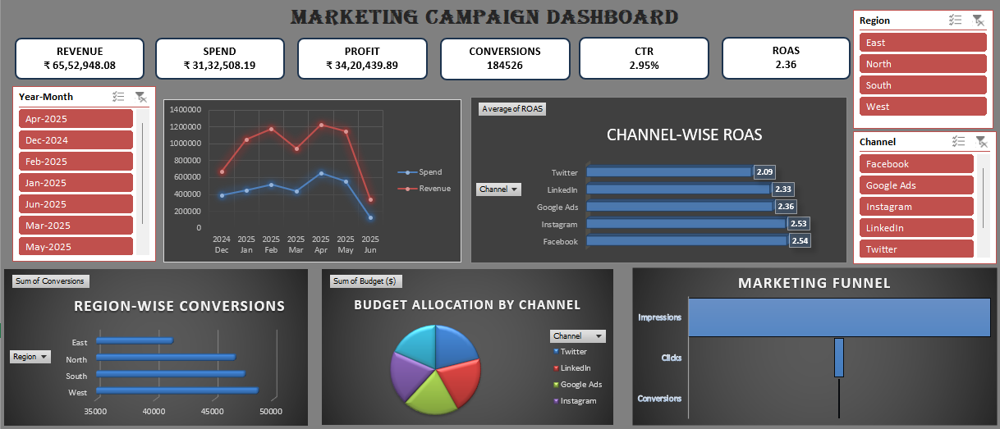

# Marketing Campaign Performance Dashboard

## Project Overview

This project presents an interactive Marketing Campaign Performance Dashboard developed in Microsoft Excel to analyze campaign effectiveness, customer engagement, conversion efficiency, and return on investment (ROI).

The dashboard enables stakeholders to monitor campaign performance across multiple marketing channels and make data-driven decisions for optimizing marketing spend.

---

## Business Problem

Marketing teams invest significant budgets across various channels such as Social Media, Email Marketing, Search Ads, and Display Advertising. Measuring the effectiveness of these campaigns is critical for maximizing ROI and improving customer acquisition strategies.

This dashboard helps answer key business questions:

- Which campaigns generate the highest revenue?
- Which marketing channels deliver the best ROI?
- What is the conversion performance across campaigns?
- How efficiently is marketing spend being utilized?
- Which devices and regions contribute most to conversions?

---

## Tools & Technologies

- Microsoft Excel
- Pivot Tables
- Pivot Charts
- Slicers
- Conditional Formatting
- Data Visualization Techniques

---

## Dataset Information

The dataset contains marketing campaign data including:

| Column |
|----------|
| Campaign Name |
| Marketing Channel |
| Impressions |
| Clicks |
| Conversions |
| Marketing Spend |
| Revenue |
| Device Type |
| Region |
| Campaign Date |

---

## Key Performance Indicators (KPIs)

### Click Through Rate (CTR)

CTR = (Clicks / Impressions) × 100

### Cost Per Click (CPC)

CPC = Spend / Clicks

### Conversion Rate

Conversion Rate = (Conversions / Clicks) × 100

### Cost Per Acquisition (CPA)

CPA = Spend / Conversions

### Return On Ad Spend (ROAS)

ROAS = Revenue / Spend

### Profit

Profit = Revenue − Spend

### Profit Margin

Profit Margin = (Profit / Revenue) × 100

---

## Dashboard Features

### Executive KPI Cards

- Total Revenue
- Total Marketing Spend
- Total Profit
- Total Conversions
- Average CTR
- Average ROAS

### Campaign Performance Analysis

- Revenue vs Spend Trend Analysis
- Campaign-wise Revenue Comparison
- Campaign-wise Profit Analysis
- Top Performing Campaigns

### Channel Performance Analysis

- Revenue by Marketing Channel
- ROAS by Marketing Channel
- Conversion Analysis by Channel

### Customer Conversion Analysis

- Marketing Funnel Analysis
- Impression to Click Conversion
- Click to Customer Conversion

### Device & Geographic Analysis

- Device-wise Revenue Distribution
- Device-wise Conversion Analysis
- Region-wise Revenue Contribution

### Interactive Dashboard Filters

- Campaign
- Marketing Channel
- Device Type
- Region
- Date

---

## Dashboard Preview

### Main Dashboard



---

## Business Insights

- Identified the highest-performing campaigns based on Revenue and ROAS.
- Evaluated channel effectiveness for marketing budget allocation.
- Analyzed customer conversion behavior using funnel metrics.
- Determined the most profitable marketing channels.
- Identified campaigns with high spending but low profitability.
- Highlighted top-performing regions and devices.

---

## Project Outcome

The dashboard provides actionable insights that help marketing teams:

- Optimize marketing budget allocation.
- Improve campaign effectiveness.
- Increase conversion rates.
- Maximize return on marketing investments.
- Support data-driven decision making.

---

## Skills Demonstrated

- Data Cleaning
- Data Transformation
- KPI Development
- Dashboard Design
- Data Visualization
- Business Intelligence
- Marketing Analytics
- Excel Reporting

---

## Repository Structure

```text
Marketing-Campaign-Performance-Dashboard/
│
├── Dataset/
│   └── Marketing_Campaign_Data.xlsx
│
├── Dashboard/
│   └── Marketing_Campaign_Dashboard.xlsx
│
├── Screenshots/
│   └── dashboard-overview.png
│
└── README.md
```

---

## Author

**K. Hima Sai Teja**

Aspiring Data Analyst | Business Analyst | Power BI Developer

GitHub: https://github.com/saiteja-416
